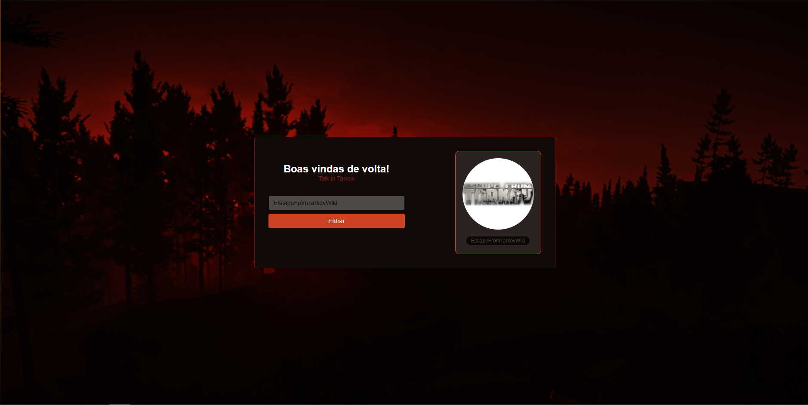

  

<h3 align="center">Talk In Tarkov</h3>

---

 Chat created in event Imerssão React whith the Alura 
      

## 📝 Table of Contents

- [About](#about)
- [Built Using](#built_using)
- [Authors](#authors)

## 🧐 About 

This project represent my participation in the Imersão React Alura

## ⛏️ Built Using 

- [NextJS](https://nextjs.org) - Deployment
- [ReactJS](https://reactjs.org) - Web Framework
- [SkynexUI](https://skynexui.dev) - Style Framework
- [NodeJs](https://nodejs.org/en/) - Server Environment

## ✍️ Authors 

- [@Leonardo Zappi](https://github.com/LeonardoZappiRamos)
